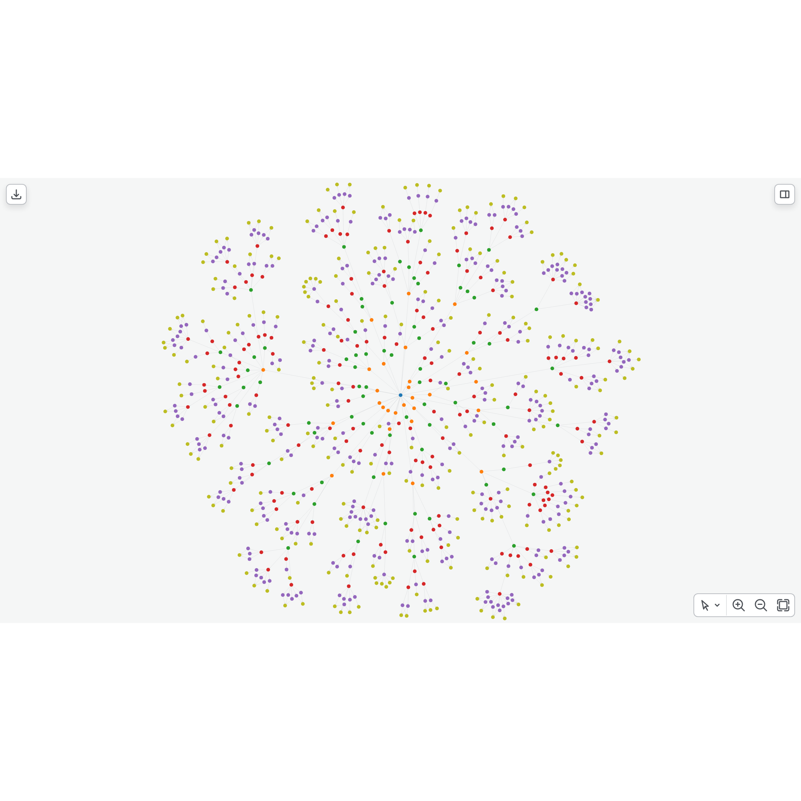
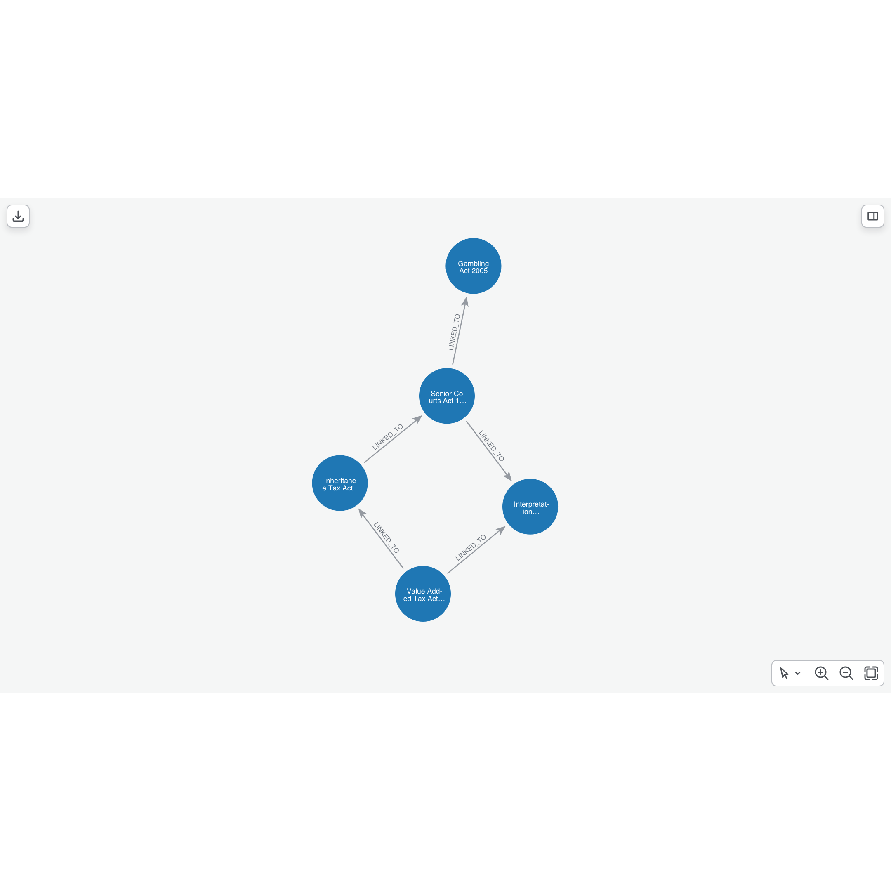
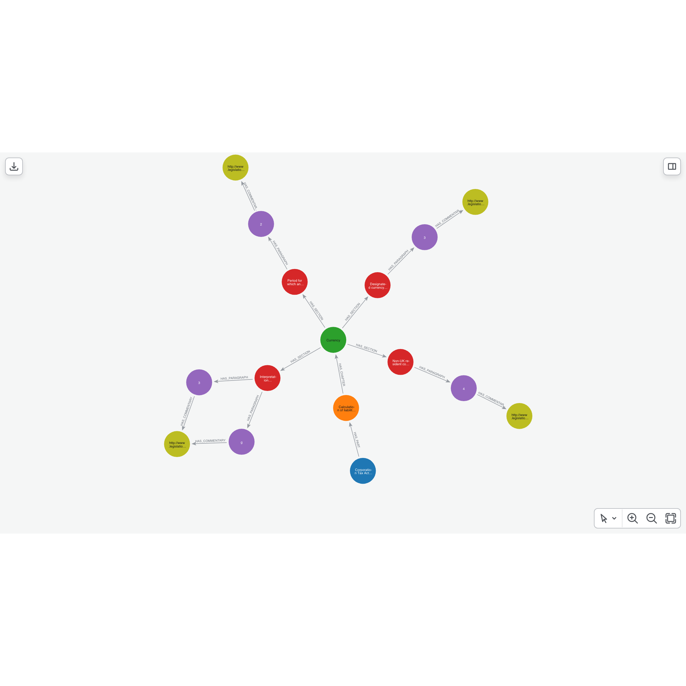

# UK Legislation Graph Explorer

This repo is an example Neo4j use case designed to transform complex legislative data into an accessible, highly structured graph database meticulously describing relationships and temporal dynamics. This tool serves as a foundational architecture for ingesting and organizing the vast corpus of UK legislation directly from the [legislation.gov.uk](https://www.legislation.gov.uk/) repositories.

By leveraging a recursive [crawler](crawler.ipynb) and a robust [data loader](loader.ipynb), this solution processes structured legislative documents adhering to the [CLML Schema](https://github.com/legislation/clml-schema). It bypasses traditional, cumbersome ETL pipelines, manual data cleansing, and unreliable PDF scraping. Instead, it directly parses XML content provided by The National Archives, transforming intricate structural hierarchies—spanning parts, chapters, sections, schedules, and explanatory notes—into a ready-to-use graph representation in Neo4j. This capability allows for complex temporal queries and deep legislative analysis. The underlying loader currently utilizes [pyspark](https://spark.apache.org/docs/latest/api/python/index.html) to optimize the transformation of raw JSON data for Neo4j, though the architecture is adaptable to standard Python environments depending on infrastructure requirements.

## Target State and Objective

Our primary objective is to cultivate a high-fidelity document knowledge graph. This refined data structure acts as an optimal foundation for [GraphRAG](https://neo4j.com/blog/genai/what-is-graphrag/) (Graph Retrieval-Augmented Generation) applications specifically tailored for the legal and professional services sectors.

  
   
  Graph Schema Representation

## Use Cases in Legal and Professional Services

Firms operating within the legal and regulatory compliance sectors face escalating challenges when navigating complex, interconnected legislation. By structuring legislative texts as a knowledge graph, organizations can deploy advanced GraphRAG solutions to significantly accelerate legal research, ensuring practitioners can rapidly trace statutory references, cross-references, and amendments across decades of law.

Compliance teams can utilize this graph architecture to map complex regulatory obligations directly to internal corporate policies, automating risk assessments and proactively identifying potential compliance gaps. In mergers and acquisitions or audit scenarios, professional services firms can leverage the graph to perform exhaustive due diligence, instantly exposing relevant statutory liabilities or intersecting regulatory frameworks that traditional keyword searches typically overlook.

  
   
  An Act as of a Specific Point in Time

## The Graph Schema

The architectural schema is designed to capture the structural hierarchy of legislation as well as the nuanced relationships intrinsic to legal texts, including citations and commentaries.

  
   
  Graph Schema Representation

## Time Stamps

As many time labels are captured by the crawler as possible, these timestamps are crucial for tracking the evolution of legislative documents and understanding the temporal context of legal provisions. These are then stored as properties at the node level (e.g., `restrict_start_date` and `restrict_end_date`).

  
   
  Time-filtered Shortest Path Between Acts

## Legislation Parser

The [crawler](crawler.ipynb) systematically parses legislative hierarchies starting from a predetermined [seed list](legislation_list.txt). At the core of this model is the `Legislation` node, functioning as the root entity with detailed attributes such as the document URI, title, type, and enactment date. The structural integrity of the document is preserved through hierarchical nodes including `Part`, `Chapter`, `Section`, and `Paragraph`, each retaining specific numerical identifiers and textual content. 

Additionally, the parser extracts supplementary materials, representing them as related `Schedule`, `ScheduleParagraph`, and `ExplanatoryNotes` nodes. The interconnected nature of legal frameworks is maintained by capturing external references as `Citation` nodes, alongside `Commentary` nodes that capture annotations linked back to specific provisions within the text.

  
   
  Detailed View of Legislation Graph

## Example Cypher Queries

To demonstrate the analytical expressiveness of this graph-based approach, the [`examples`](examples.ipynb) notebook provides practical Cypher query patterns. These illustrate how to navigate complex legislative relationships, extract deeply nested textual provisions, and conduct comprehensive legal analyses within the Neo4j environment.

## Current Status and Future Enhancements

There is still work to do to have a fully comprehensive and optimized legislative knowledge graph. In particular ordering isn't yet fully implemented across all node types, which is crucial for accurately reconstructing the chronological sequence of legal texts. Also, unapplied effects are not yet captured in the graph, and there are also various XML blocks which need to be extracted (e.g., `<InlineAmendment>` as well as `<Substitution>`, `<Addition>`, etc.). 