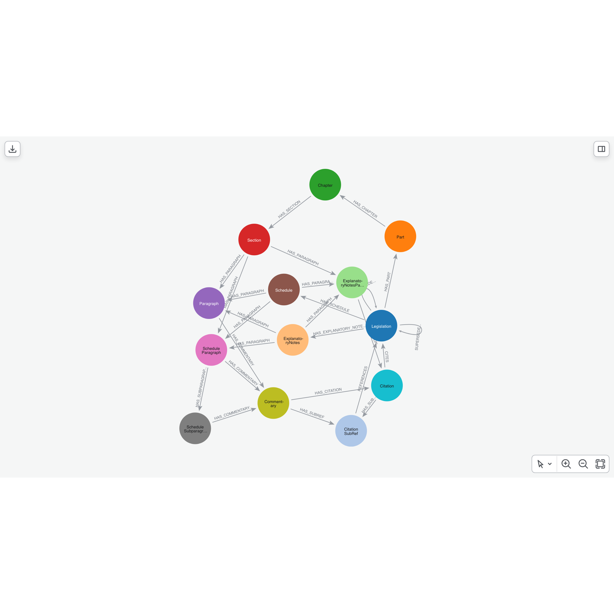

# UK Legislation Graph Explorer

> **Work in progress:** This tool is not yet fully reliable for extracting the entire UK legislation corpus, but it is a starting point for building a graph database of UK legislative documents. It is designed to be extensible and adaptable to the complex XML format used by [legislation.gov.uk](https://www.legislation.gov.uk/).

This repository provides a [crawler](crawler.ipynb) and [data loader](loader.ipynb) for structured legislation documents following the [CLML Schema](https://github.com/legislation/clml-schema). It helps you build a graph database of official legislation **without** needing a complex ETL pipeline, PDF processing, or manual data cleansing. We provide a recursive crawler capable of extracting structured data directly from XML content provided by The National Archives, and subsequently the loader transforms and loads this data into Neo4j.

The schema for UK legislation is complex - the crawler and loader handle much of this complexity by extracting the hierarchy of legislation (parts, chapters, sections, paragraphs, schedules, subparagraphs, explanatory notes, etc.), as well as citations, cross-references, commentaries, and related information - turning it into a ready made graph representation in Neo4j. It aims to capture as much structure as possible, supporting complex as well as temporal queries.

> The [loader](loader.ipynb) uses [pyspark](https://spark.apache.org/docs/latest/api/python/index.html) to transform raw JSON data for Neo4j. You can refactor it to use plain Python if needed.

## Target State and Objective

The goal of this is to build a **high quality** document store which can be used as a knowledge source for [GraphRAG](https://neo4j.com/blog/genai/what-is-graphrag/) powered applications in the legal and professional services domain.

## The Graph Schema

The resulting graph schema is designed to capture the hierarchical structure of legislation, as well as relationships between different pieces of legislation, citations, and commentaries.

## Legislation Parser

The [crawler](crawler.ipynb) extracts the hierarchy of legislation from a [seed list](legislation_list.txt), including:

- **`:Legislation`**: The root node for each piece of legislation, with properties like `uri`, `title`, `type`, `enacted_date`, etc.
- **:`:Part`, `:Chapter`, `:Section`, `:Paragraph`**: Nodes representing the structural hierarchy of legislation, with properties like `number`, `title`, and `text`.
- **`:Schedule`, `:ScheduleParagraph`, `:ScheduleSubparagraph`**: Nodes representing schedules and their components.
- **`:ExplanatoryNotes`**: Explanatory notes included in legislation
- **`:Citation`**: Nodes representing citations to other legal acts and provisions
- **`:Commentary`**: Nodes representing commentaries linked to specific paragraphs or sections.

## Example Cypher Queries

The [`examples`](examples.ipynb) notebook exemplifies how to run Cypher queries against the graph database to explore relationships between legislation, retrieve text, etc.

## TODO

- ~~**Unique IDs:**~~
  - ~~IDs like commentary and ref IDs are only unique within a single legislation. Unique IDs must be generated when loading into the graph database.~~

- **Citations, Sub-Refs, and Commentary:**
  - The structure is currently messy and redundant. Needs refactoring. Commentaries should be linked to their respective paragraph (`CommentaryRef`).

- **Ordering:**
  - Add remaining `order` properties to all nodes.